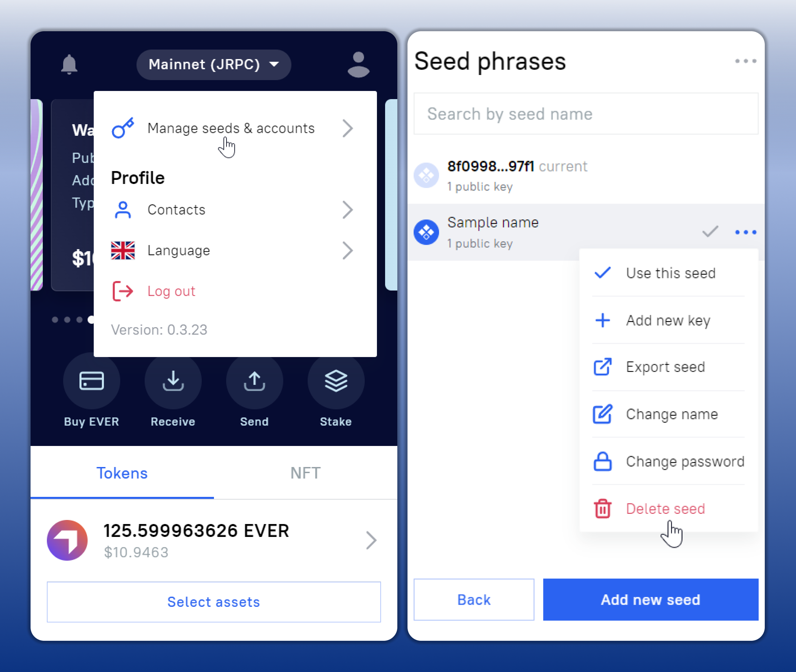

# Sign in with existing seed phrase Extension

If you have already created a wallet on the Everscale network, you can add it to your EVER Wallet using your existing seed phrase.

1. Click on the EVER Wallet icon in the Chrome extensions menu to go to the wallet creation/login page.
2. Select `Sign in with seed phrase`.
3. Create a `password`. It will be used to confirm transactions.

<figure><figcaption></figcaption></figure>
