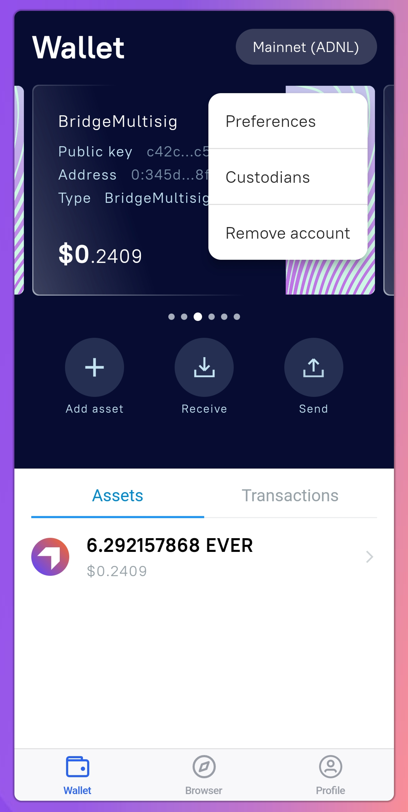

# EVER Wallet App

Ever Wallet allows you to add an unlimited number of [keys](../architecture.md#public-key) to any seed.

### Add/Delete key

1. Go to `Profile` and select `Manage seeds & accounts`
2. Select the desired `seed`
3. Click on `Add key` at the top of the screen
4. Select any number of `keys` you want to add, or uncheck the `keys` that you want to remove and click `Select`

<figure><figcaption></figcaption></figure>


This way, you can add and remove keys from the list. \
To make a new key active, go to the [key management menu](ever-wallet-app.md#manage-key).


### Manage key

There are three steps to get to the key management menu:

1. Go to `Profile` and select `Manage seeds & accounts`
2. Select the desired `seed`
3. Click on the three dots to the right to open the management menu
